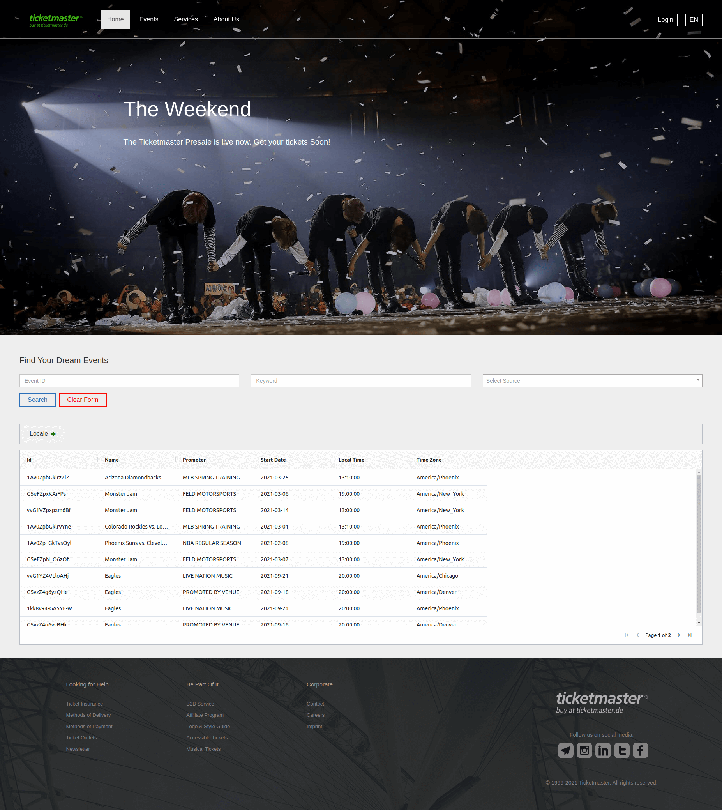

Connecting a REST service to a sortable table 
=============================================

> By Elham Ajdari

Features
--------

- Use npm (node package manager)
- Use Webpack to build final JS and CSS file
- Use http-server to run the project
- Good architecture (separated concepts, components and services)
- Clean code (DRY, good naming, formatting, separated functions and concepts)
- Use SASS
- Use `Ag Grid`, because it is in top 5 JavaScript data grids (https://bit.ly/36Sjhgh)
- Use ECMAScript
- Full responsive (PC, Mobile and Tablet)
- Single Page Applications (SPA)
- Keep the size of the page (transferred files) under 2.5 MB
- Cross-Platform Testing (Linux and windows)
- Cross-device Testing (Samsung and iPhone mobile)
- Use Bootstrap
- Use select2
- Optimized images for web

Installation
-----------

1- Install npm

2- Install node

3- Clone the project

4- Open a terminal and run:
```
$ cd <project-root>
$ npm run build
$ sudo npm install http-server -g
```

5- Now run the following command to start the server and open the project in your browser automatically.
```
$ http-server -o ./src
```

Next steps to improve the project
---------------------------------

Due to lack of time, the following steps have not been implemented in the project.
Therefore, it would be better to implement them as well.

- Implement Routing
- Write Tests
- Cross-Browser Testing
- Improve SASS files to use mixins and variables
- Implement `api-call-service` todo comments

Screenshot of the project
-------------------------

